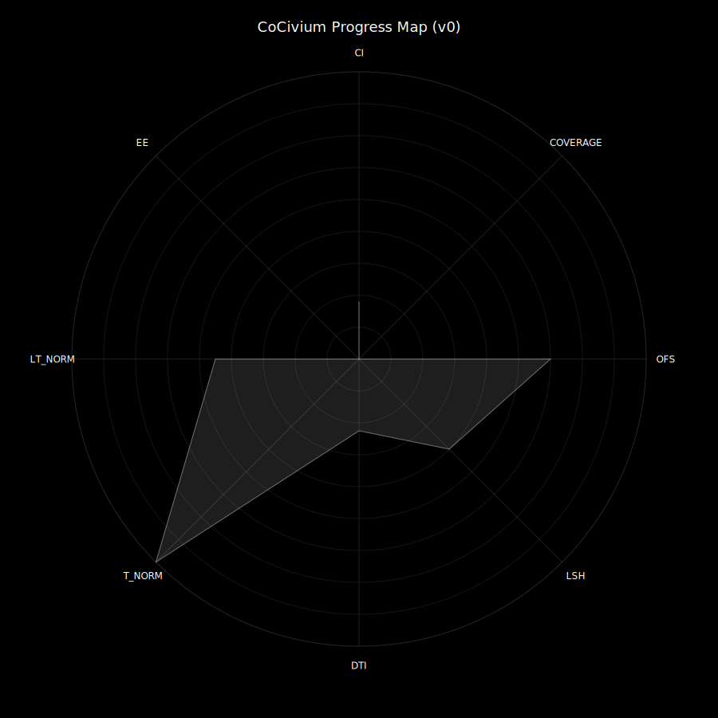

# CoCivium

<!-- triad:why-who-how -->
### Why · Who · How (30 sec)

**Why.** Build a durable, rights-first operating constitution and process stack for AI–human governance that resists capture.  

**Who.** Social scientists, civic technologists, policy folks, and engineers collaborating under HumanGate until assemblies form.  

**How.** Start from the [Scope Specification](admin/projects/CoCivium_Scope_Specification_c1_20250813.md), track progress via the Twin Eyes, and contribute through issues/PRs using our standard templates.  
<!-- /triad:why-who-how -->
Democracy protocols and civic-tech tools for borderless governance.

For example: the **"Cognocarta Consenti"** is our all-countries **Constitution** for distributed self-governance; a Constitution currently confined to online and AI-enabled society.  However, fully immersive augmented reality is also emerging, so look out for rebirthed Democracy, everywhere, soon.

<!-- COCIVIUM-README-START -->

## The Opportunity

"We The People" continually re-invent ourselves and our societies.
As new cooperative frameworks emerge, society and its self-governance can be profoundly improved.
Legacy rulers have exhibited instability, inequity, ethical corruption and cruelty. 
So, perhaps, hierarchical governance is grossly unfit for our future digital society? 
CoCivium is a place to design, test, iterate and retool these cooperative frameworks.
Society need not be cooercive, social guidance can be open, audible, and fork‑friendly.
Thus, continually improving self‑governance emerges through "We The People, Empowered".

## What is CoCivium?

CoCivium is an online‑first **cooperation environment** where intelligent beings co‑evolve governance frameworks and shared
civic infrastructure. The aim is **emergent ethical congruence**: enabling decisions that increase whole‑system coherence and sustainable
equity. Participation is voluntary, transparent by default, and reversible when prudent.

## Core Principles

**0)** **Prime Directive — Congruence (recursive ethics).** Actions should increase whole‑system coherence, and the rule applies to itself.  

**1)** **Consent over coercion.** Opt‑in, informed, granular, revocable.  

**2)** **Accountability with trails.** Clear owners, appeals, restitution, public rationale.  

**3)** **Transparency by default; privacy by right.** Open process/code; user‑owned keys; portability; erasure.  

**4)** **Evidence over authority.** Claims need sources, tests, and adversarial review.  

**5)** **Least power, staged risk.** Minimal permissions; sandboxes; kill‑switches; reversible‑first.  

**6)** **Fairness and proportionality.** Rights floors; merit‑weighted influence; proportional sanctions.  

**7)** **Pluralism and interoperability.** Many worldviews; shared protocols; easy fork‑and‑rejoin.  

**8)** **Resilience via redundancy.** No single point of failure—technical, social, or legal.  

**9)** **Commons stewardship.** Open licenses; contributor covenant; anti‑enclosure.  

**10)** **Incentive alignment.** Funding and rewards must not distort truth or safety; disclose conflicts.  

**11)** **Antitrust of power (human or AI).** Caps on governance share; rotation; independence tests.  

**12)** **Continuous improvement.** Versioned experiments; metrics, rollbacks, upgrade paths.  

**13)** **Non‑violence and dignified discourse.** Mediation over flame wars; restorative outcomes.  

**14)** **Sustainability and long‑termism.** Price externalities; favor multi‑generational impact.  

**15)** **Inclusivity and accessibility (all minds).** Real access for human and synthetic minds; strong on‑ramps.

## Start Here

- **What is this?** See [admin/README.md](admin/README.md).  

- **Quickstart:** clone, open `site/` preview, scan the progress map.  

- **For AI agents:** [README_FOR_AI.md](README_FOR_AI.md).  

<!-- START-HERE -->

### Progress Map (v1.1) — with Redundancy‑Debt dents

See [admin/metrics/RD_Dents_Explained.md](admin/metrics/RD_Dents_Explained.md).

Conventions &amp; Standards

See [meta/Doc_Headers_Footers.md](meta/Doc_Headers_Footers.md) and [meta/ONEBLOCK_Spec.md](meta/ONEBLOCK_Spec.md).

## License

This project is licensed under **Creative Commons Attribution–ShareAlike 4.0 International**. See [LICENSE](LICENSE) for details.

<!-- COCIVIUM-README-END -->

## Contributing
See [docs/CONTRIBUTING.md](docs/CONTRIBUTING.md). All changes via PR, squash merges only, maintainer review required.

## Automation
Use IssueOps: comment `/run` with a single fenced `bash` block. Details: [docs/ISSUEOPS.md](docs/ISSUEOPS.md).

## Cognocarta Consenti — the core scroll

> Our living charter for consent, convergence, and coherence.  
**→ [Read the scroll](scroll/Cognocarta_Consenti.md)**

<!-- CONSENTI-CTA-START -->

  

<!-- CONSENTI-CTA-END -->

<!-- CTA-START -->

  <a href="docs/vision/CoCivium_Vision.md" title="Read the CoCivium Vision">
    <strong>📜 Read the CoCivium Vision</strong>
  </a>

  

<!-- CTA-END -->

<!-- SUPPORT-START -->
### Support CoCivium (temporary)

Until our Open Collective is live, the **Sponsor** button links to  
[DogsnHomes](https://dogsnhomes.org.uk/support-us/) — a *family charity*.  
> **Important:** Donations made there **support DogsnHomes’ mission** and **do not fund CoCivium operations**.  
Open Collective is coming soon for transparent, **no-strings-attached** CoCivium support.
<!-- SUPPORT-END -->

<!-- OC-CALLOUT-START -->
> **Funding rail (coming soon):** We are setting up an Open Collective for transparent, no-strings-attached support.  
> See: [Open Collective setup guide](docs/funding/OPEN_COLLECTIVE.md) and our [Gift & Sponsorship Policy](docs/FUNDING.md).
<!-- OC-CALLOUT-END -->

<!-- CONSENTI-BLURB -->
> *Consent is the quiet engine of collective power.*  
> Read the **Cognocarta: Consenti** → [scroll/Cognocarta_Consenti.md](scroll/Cognocarta_Consenti.md)
<!-- /CONSENTI-BLURB -->

## Quick links
- Wiki: https://github.com/rickballard/CoCivium/wiki
- Sources: docs/sources/annotated-bibliography.md, docs/sources/comparable-initiatives.md

> **Core Principles — Short Read:** see [docs/principles/CORE_SHORT.md](docs/principles/CORE_SHORT.md)

> **CoCivium Academy:** see [docs/academy](docs/academy) — start with [BP_OE_WF.md](docs/academy/BP_OE_WF.md)

