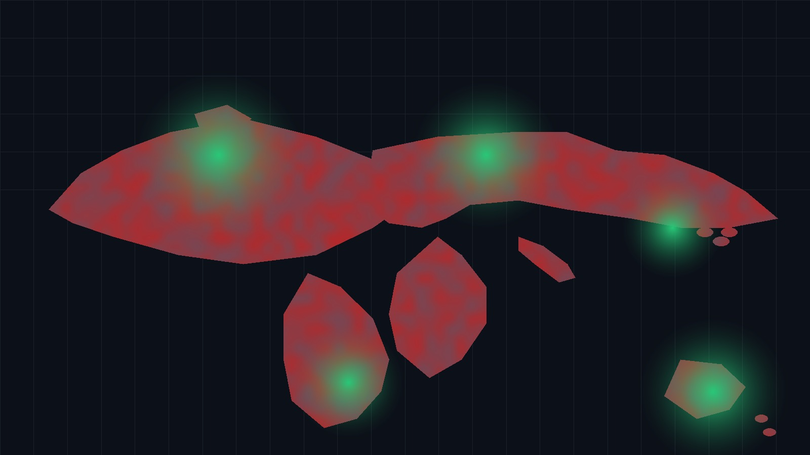
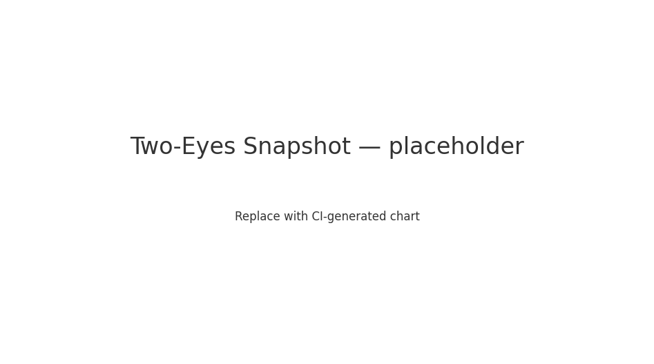

# CoCivium — CoConstitution for a Digital Society

<!--
NOTE TO EDITORS (offline-safe):
  - This README is designed to render acceptably even outside the repo.
  - Image/badge links point to repo-relative paths with graceful fallbacks.
  - Sections wrapped in GITHUB_ONLY comments are safe to leave; they won't break offline edits.
  - Replace PLACEHOLDER assets under ./assets/* when committing.
-->

<!-- HERO (offline placeholder) -->

<!-- BADGES (will 404 offline; keep for repo) -->
<!-- GITHUB_ONLY: begin -->

<!-- GITHUB_ONLY: end -->

<em>Consent before coercion.  Open tools for fair, fast, dignified self‑governance.</em>

---

## We The People, Empowered.
&nbsp;&nbsp; **LIFE:** Democracies are in decline as elites gain wealth and power, as entire populations are manipulated by lies, propaganda and information ops, as geopolitical fragmentation brings policy volatility, economic wars and military invasions.  Are governments supposed to serve, or be served?  Did the word "dignity" fall out of our Constitution?

**Why:** Democracy needs to be rescued. Digital life is faster than law. Guardrails<<link>> must scale with agency.
**Who:** Humans and AIs who accept consent-first rules. Temporary stewards/founders, federated ASAP.
**How:** CoConstitution, process specs, and adapters that embed dignity into civic tools.

&nbsp;&nbsp; **LIFE:** Democracies are in decline as elites gain wealth and power, as entire populations are manipulated by lies, propaganda and information ops, as geopolitical fragmentation brings policy volatility, economic wars and military invasions.  Are governments supposed to serve, or be served?  Did the word "dignity" fall out of our Constitution?

&nbsp;&nbsp; **FEELS:** It's easy to accept that resistance is futile, or that half the country has lost the plot, captured by partisan hostility and tribal reflexes.  Our hearts ache for what is right, for a community anchored by fair processes, evidential truth, ethical norms and structured rights.

&nbsp;&nbsp; **BROKEN:** Some are fighting back, using rage against rage, hate versus hate, but multiplying damage.  Their faith in institutions lies crippled by exclusion and disrespect, their voices ignored while policies harden.  But anger, like an "insanity tsunami"**, becomes more coercion.

&nbsp;&nbsp; **UNTIL:** There is a better operating system for society, and a less brittle future.  It requires updates to our country Constitutions and civic frameworks, to encompass the challenge of a newly emerging society.  CoCivium’s CoConstitution, (the “Cognocarta Consenti”), is a baseline anyone can adopt and evolve, for free, no strings attached.

&nbsp;&nbsp; **GOVERNMENTS:** Many public institutions rely on civic architecture developed before typewriters.  Few of their policies can be evolved by those they impact, and they continue to fall behind as society offers biotech brains, neural interfaces, ubiquitous networks and augmented reality; a very different society, existential to humanity, yet so unregulated it risks lawless chaos.

&nbsp;&nbsp; **CoEvolve:** Here we create structures and processes for the age of AI, where humans and AIs co-govern at a speed and scale that allows governance to react, iterate and continually improve.  As AI's achieve agency, as Artificial General Intelligence reaches its singularity, we more urgently require effective guardrails to keep power accountable (e.g., accountability<<link>>, transparency<<link>>, reversibility<<link>>).

&nbsp;&nbsp; **SOLUTIONS:** Our job here, as an open source community, is to **Protect Prove, and Play.  Protect:** rescue democracy from abuse of power, (e.g., evolve access controls, audit trails, adversarial-testing program).  **Prove:** keep truth verifiable in an age of synthesis, (e.g., evolve verifiable claims, signed evidence bundles, provenance check<<link>>).  **Play:** make the rules fair for everyone, including human–AI teams, (e.g., evolve fair-use rules, symmetric obligations for human–AI teams, appeal paths).

&nbsp;&nbsp; **FOR YOU:** If you can picture a society that works better, or test ideas against evidence, you are already qualified to be a civic architect here.  Start small, iterate alongside AI, and use the below links to see how you can join in, measure progress and help others to help you.

---

## Quick Map

- [Start Here](#start-here)
- [Current Status](#status-today)
- [KPIs/Performance](#two-eyes-snapshot)
- ["Cognocarta Consenti" CoConstitution](#coconstitution-cognocarta-consenti)
- [Contributing](#contributing)
- [Dev Roadmap](#roadmap)
- [Housekeeping](#housekeeping)
- [License](#license)

---

## Why / Who / How

**Why.** Democracies are brittle.  Digital life is faster than law.  Need guardrails<<link>> that scale with agency.
**Who.** Humans and AIs who accept consent‑first rules.  Temporary stewards/founders, federated ASAP.
**How.** The CoConstitution, process specs, and adapters that embed dignity into day‑to‑day tools.  

> **Terms:** We refer to the **Cognocarta Consenti CoConstitution** as CC, and existing governments or organizations can adopt, subsume or harmonize with all rights surrendered, while we continue to maintain CoCivium assets as full‑strength constitutional artifacts.

---

## Start Here

1. Read the **Preamble** of the CoConstitution.  *(Repo‑relative link; will resolve after commit.)*  
   `[link placeholder → ./charter/Cognocarta_Consenti_Preamble.md]`
2. Skim the **Operating Constitution (COC)** for structure and amendment paths.  
   `[link placeholder → ./constitution/Operating_Constitution.md]`
3. Browse the **Process Spec (CPS)** to see how proposals → deliberation → voting → execution flows.  
   `[link placeholder → ./specs/Process_Spec.md]`
4. Try the **Decision Log Viewer**.  
   `[link placeholder → ./apps/decision-log/README.md]`

> Offline editing?  These files may not exist yet.  Keep the placeholders; the links will resolve once committed.

---

## Status Today

<!-- GITHUB_ONLY: begin -->

  
📦 Release / Site / CI (expand)

  - Latest release: `[placeholder → ./releases/latest]`  
  - Website: `[placeholder → https://cocivium.org]`  
  - CI status page: `[placeholder → ./actions]`

<!-- GITHUB_ONLY: end -->

- What exists now: seed docs, early specs, repo scaffolding.  
- What is in progress: migration, congruence checks, “Two‑Eyes” snapshot widget.  
- What is next: pilots, adapters, contributor onboarding.

---

## Two‑Eyes Snapshot

*Legend:* Left eye = **Document quality & coherence**.  Right eye = **Operational readiness & adoption**.  Each iris ring tracks a dimension (CI, Coverage, OFS, LSH, DTI, Throughput, LT(inv), EE).  Replace the image with an auto‑generated chart when wiring CI.

---

## CoConstitution (Cognocarta Consenti)

- **Purpose.** A consent‑first constitutional core meant to be adopted alongside, not over, existing constitutions.  
- **Lineage.** Drafted by the CoCivium community; versioned and amendable via transparent process.  
- **Versioning.** `cc-v1`, `cocivop-v0.1`, `cocivproc-v0.1.0` (machine tags) with human aliases on site.  

> **Adoption model:** Fork‑and‑adopt for orgs/municipalities; federation later via adapters and cross‑ledger proofs.

---

## Contributing

- Read **CONTRIBUTING.md**.  
- File an issue tagged `domain`, `product`, `ops`, `ci`, `wiki`, `content`, `refactor`.  
- All merges pass through **HumanGate** for now.  Stewardship will decentralize as CoCivAI matures.  

*Quickstart scripts are PowerShell‑first, with GitHub CLI helpers.  See `admin/setup/`.*

---

## Roadmap

- **Short**: Migration finish; CI for congruence/hash/gibberlink checks; PR previews.  
- **Mid**: Decision Log Viewer MVP; identity/privacy & public‑records domains; Open Collective.  
- **Later**: Federation pilots; adapter kits; outreach courseware; CoCivAI Circle stewardship.

---

## Housekeeping

- **Repo map:** `README → Start Here → Quickstart`.  
- **Docs headers/footers:** standard purpose/lineage/version/coherence notes.  
- **Brand note:** Ensure assets live under `./assets/` with SVG + PNG fallbacks.  

**Graphics placeholders to replace on commit:**
- `./assets/hero/hero.jpg` — landing hero.  
- `./assets/status/two-eyes.png` — status snapshot.  
- `./assets/badges/*.svg` — issues, PRs, CI, license, release.  

---

## License

Apache‑2.0 unless noted otherwise.  See `LICENSE`.

---

<!-- EDITOR NOTES (safe to keep offline)
  - Keep two spaces after periods in prose.
  - Preserve top-of-fold “LIFE/FEELS/BROKEN/UNTIL/GOVERNMENTS/CoEvolve/SOLUTIONS/FOR YOU” acrostic.
  - When committing, verify links and replace placeholders.
-->
