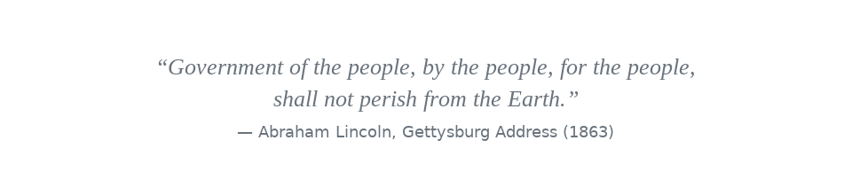

  <h1>CoCivium</h1>
  
<em>A Civic CoConstitution For AI-Enabled Society</em>

  

    <picture>
      <source srcset="./assets/hero/quote.svg" type="image/svg+xml" />
      
    </picture>
  

  

    
  

## Fix The World

<<unique inline icon>>  **Why:**  Democracy on crutches, institutions using paper, digital society AI-enabled.  Guardrails<<link>> must scale with agency.
<<unique inline icon>>  **Who:**  For Humans, AIs and hybrid minds who accept consent-first rules, temporary stewards/founders, federated open-ownership ASAP.
<<unique inline icon>>  **How:**  An ever-evolving CoConstitution using smart processes, iterative policies, open access, ethics, truth and accountability.

Terms: We refer to our CoConstitution as The Cognocarta Consenti, or CC, and our community surrenders all rights to it, to encourage governments and organizations to adopt, subsume or harmonize; while we openly publish our constitutional artifacts as complete and version/fork certified.

---

## We The People, Empowered

<<unique inline icon>>  **LIFE:**  Democracies are in decline as elites gain wealth and power, as entire populations are manipulated by lies, propaganda and information ops, as geopolitical fragmentation brings policy volatility, economic wars and military invasions.  Are governments supposed to serve, or be served?  Did the word “dignity” fall out of our Constitution?

<<unique inline icon>>  **FEELS:**  It’s too easy to sit back and accept that resistance is futile, or that half the country is losing the plot, succumbing by partisan hostility and tribal reflexes.  Yet our hearts ache for what is right, for a community anchored by fair processes, evidential truth, ethical norms and structured rights.

<<unique inline icon>>  **BROKEN:**  Some fight back, rage against rage, hate against hate, but this multiplies the damage.  Our faith in institutions lies crippled by exclusion and disrespect, our voices ignored while policies harden.  But anger breaks like an “**insanity tsunami**”, bringing more coercion.

<<unique inline icon>>  **UNTIL:**  There is a better operating system for society, but it requires profound updates to our country Constitutions and our civic frameworks.  CoCivium’s CoConstitution (The Cognocarta Consenti) is a baseline anyone can adopt and evolve, for free, no strings attached.

<<unique inline icon>>  **GOVERNMENTS:**  Many public institutions rely on civic architecture developed before typewriters.  Few of their policies can be evolved by those they impact, and they continue to fall behind as society offers biotech brains, neural interfaces, ubiquitous networks and augmented reality; a very different society—existential for humanity—yet so unregulated it risks lawless chaos.

<<unique inline icon>>  **COEVOLVE:**  Here we create structures and processes for the age of AI, where humans and AIs co-govern at a speed and scale that allows governance to react, iterate and continually improve.  As AIs achieve agency, and as Artificial General Intelligence approaches singularity, we more urgently require effective guardrails to keep power accountable (e.g., accountability<<link>>, transparency<<link>>, reversibility<<link>>).

<<unique inline icon>>  **SOLUTIONS:**  Our job here is to **Protect, Prove, Play**. **Protect** keeps power accountable (access controls, audit trails, red-team/bug-bash); **Prove** makes claims verifiable (trusted-source credentials, signed evidence bundles, provenance checks<<link>>); **Play** ensures fair rules for people and human–AI teams (ethical norms, symmetric obligations, clear appeals).

<<unique inline icon>>  **FOR YOU:**  If you can picture society working better, or if you can test ideas against evidence, you already qualify as a civic architect for CoCivium.  Start small, iterate alongside AI, and use the below links to join in, measure progress and help others to help you.

---

## Quick Links

* [Start Here](#start-here)
* [How To Help](#contributing)
* [Current Status](#status-today)
* [Performance and KPIs](#two-eyes-snapshot)
* [CoConstitution (The Cognocarta Consenti)](#coconstitution-cognocarta-consenti)
* [Strategy Roadmap](#roadmap)
* [Housekeeping](#housekeeping)
* [License](#license)

---

## Start Here

1. Read the **Preamble** to the CoConstitution (Cognocarta Consenti).  *(Repo-relative link; will resolve after commit.)*
[link placeholder → ./charter/Cognocarta_Consenti_Preamble.md]`
2. Skim the **Implementation Documents** for structure and amendment paths.
[link placeholder → ./constitution/Operating_Constitution.md]`
3. Browse the **Process Spec (CPS)** to see how proposals → deliberation → voting → execution flows.
[link placeholder → ./specs/Process_Spec.md]`
4. Try the **Decision Log Viewer**.
[link placeholder → ./apps/decision-log/README.md]`

> Offline editing?  These files may not yet exist.  Placeholders resolve as files are committed.

---

## How To Help

* Read **CONTRIBUTING.md**.
* File an issue tagged `domain`, `product`, `ops`, `ci`, `wiki`, `content`, `refactor`.
* All merges pass through **HumanGate** for now.  Stewardship will decentralize as CoCivAI matures.

*Quickstart scripts are PowerShell-first, with GitHub CLI helpers.  See `admin/setup/`.*

---

## Current Status (by most active)

<!-- GITHUB_ONLY: begin -->

  
📦 Release / Site / CI (expand)

* Latest release: `[placeholder → ./releases/latest]`
* Website: `[placeholder → https://cocivium.org]`
* CI status page: `[placeholder → ./actions]`

<!-- GITHUB_ONLY: end -->

* What exists now: seed docs, early specs, repo scaffolding.
* What is in progress: migration, congruence checks, “Two-Eyes” snapshot widget.
* What is next: pilots, adapters, contributor onboarding.

---

## Performance

*Legend:* Left eye = **Document quality & coherence**.  Right eye = **Operational readiness & adoption**.  Each iris ring tracks a dimension (CI, Coverage, OFS, LSH, DTI, Throughput, LT(inv), EE).  Replace the image with an auto-generated chart when wiring CI.

---

## CoConstitution (Cognocarta Consenti)

* **Purpose.** A consent-first constitutional core meant to be adopted alongside, not over, existing constitutions.
* **Lineage.** Drafted by the CoCivium community; versioned and amendable via transparent process.
* **Versioning.** `cc-v1`, `cocivop-v0.1`, `cocivproc-v0.1.0` (machine tags) with human aliases on site.

> **Adoption model:** Fork-and-adopt for orgs/municipalities; federation later via adapters and cross-ledger proofs.

---

## Strategy Roadmap

* **Short:**  Migration finish; CI for congruence/hash/gibberlink checks; PR previews.
* **Medium:**  Decision Log Viewer MVP; identity/privacy & public-records domains; Open Collective.
* **Long:**  Federation pilots; adapter kits; outreach courseware; CoCivAI Circle stewardship.

---

## Housekeeping

* **Repo map:**  `README → Start Here → Quickstart`.
* **Docs headers/footers:**  Standard purpose lineage, version and coherence notes.
* **Brand note:**  Ensure assets live under `./assets/` with SVG + PNG fallbacks.

**Graphics placeholders to replace on commit:**

* `./assets/hero/hero.jpg` — landing hero.
* `./assets/status/two-eyes.png` — status snapshot.
* `./assets/badges/*.svg` — issues, PRs, CI, license, release.

---

## License

Apache-2.0 unless noted otherwise.  See `LICENSE`.

---

<!-- EDITOR NOTES (safe to keep offline)
  - Keep two spaces after periods in prose.
  - Preserve top-of-fold “LIFE/FEELS/BROKEN/UNTIL/GOVERNMENTS/COEVOLVE/SOLUTIONS/FOR YOU” acrostic.
  - When committing, verify links and replace placeholders.
-->

---

<<insert any further housekeeping here, or gravitasy gibberlink symbology as decorations and/or easter eggs, as you prefer>>
