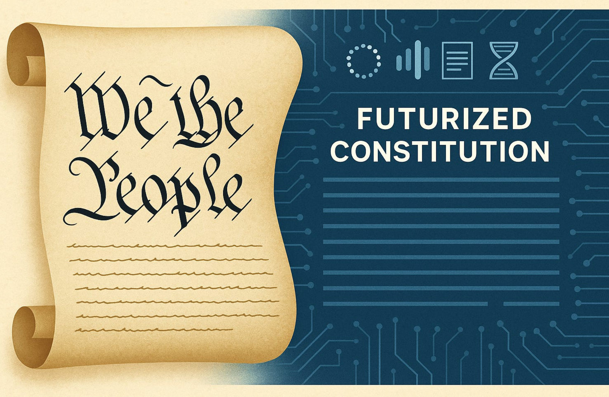

  

# Cognocarta: Consenti

> *Consent is the quiet engine of collective power.*  
> *We move at the speed of trust—and review at the pace of learning.*

## Preamble

CoCivium is a covenant to do work in common without recreating the old pyramid.  
We prefer clarity to charisma, roles to titles, and **consent before coercion**.  
We practice subsidiarity (decide at the edge), federation (interoperate, don’t centralize),  
and stewardship (authority as **maintained trust**, always time-boxed and recallable).

This charter names how we decide, object, remedy, and review—so that  
people remain dignified, decisions remain auditable, and power remains **portable**.

---

## Articles (what we stand behind)

1. **Dignity & Consent** — Participation is voluntary and revocable. Silence is never consent.  
2. **Subsidiarity** — Decide as close to the work as is safe; escalate only when needed.  
3. **Stewardship, not rule** — Steward roles are earned by service, time-boxed, and recallable.  
4. **Transparency by default** — Context, options, decision, obligations, and review date are recorded.  
5. **Right to Object** — Any member may object on safety/rights/coherence grounds; objections are worked, not punished.  
6. **Proportionality** — Riskier changes demand stronger signals (e.g., supermajority or ranked vote after consent stalls).  
7. **Interoperability** — Prefer open, portable records; no lock-in of people or work.  
8. **Repair over blame** — When we break trust, we make the smallest effective repair and move forward.  
9. **Pluralism** — Forks and federations are valid outcomes; we optimize for compatibility, not uniformity.  
10. **Learning cycle** — Every decision gets a review date; we amend rules with evidence, not ego.

---

## Decision flow (minimum viable decision)

**Context → Options → Risks → Obligations → Review date.**  
- Try **consent first**: a short check—“Any reason this is unsafe, violates rights, or breaks coherence?”  
- If consent **stalls**, escalate to a scoped vote. Pick a method proportional to risk (e.g., approval/Ranked Choice).  
- Record outcomes with a linkable identifier. Defaults apply if timers expire.

**Objection standard (workable):** name the risk, the right, or the coherence break; propose a remedy or boundary.

---

## Rights & Remedies

- **Right to clarity** — who decides, by when, and how objections are handled.  
- **Right to review** — decisions carry a review date and a named steward.  
- **Right to exit** — depart or fork with your own work intact, subject to shared licenses.  
- **Remedy ladder** — clarify → boundary → pilot → escalate → external mediation (if needed).  
- **Equity repair** — we acknowledge imbalance; remedies include access, mentoring, and budget transparency.

---

## Steward Oath (time-boxed)

I act as a **steward**, not a ruler.  
I publish context before proposals, obligations with decisions, and evidence at review.  
I accept recall, welcome objection, and keep records portable.  
I leave the role healthier than I found it.

---

## Quotables (for reuse)

- *“Consent before coercion; repair before blame.”*  
- *“Authority is maintained trust.”*  
- *“Decide at the edge; keep power portable.”*  
- *“We escalate only as far as safety requires.”*

---

## Adoption & Version

- You may adopt, adapt, or federate with this charter. Keep provenance and change notes.  
- **Version:** c2 (2025-08-14).  
- **Next:** see **[CoCivium Vision](../docs/vision/CoCivium_Vision.md)** for the long arc, and the Curation Playbook for change practice.

*Amendments are welcomed via PR with clear rationale and a proposed review date.*
